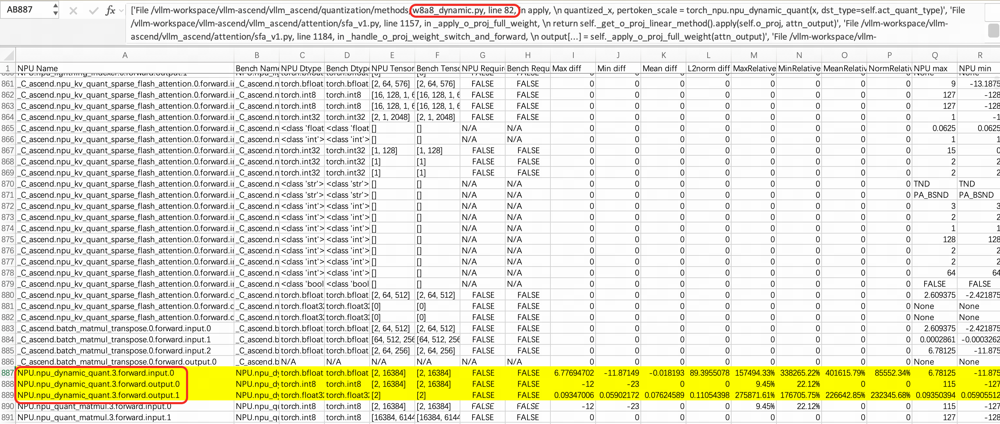

# vLLM-Ascend 首请求乱码问题定位报告（hw_6 / GLM-5.2-W4A8C8）

- 日期：2026-09-16（定稿）
- 环境：itask pod `hw_6`，8 × 910B2C（64C / 800G / 8 卡），镜像 `hcr.meta-wulan01.hw-wulan.local/antsys/vllm:v0.23.0-openeuler-20260819150428`
- 代码：vLLM 0.23.0，vllm-ascend commit `5cb98caaa`，editable 安装于容器内 `/vllm-workspace/vllm-ascend`
- 模型：`modelhub_63200010_glm-5-2-w4a8c8-135400046_20260720103657`（391G，w4a8c8 量化）
- 启动配置：`start.sh` 原样（TP8 / DCP8 / enforce-eager / seed 1024 / `enable_sparse_sfa_c8: true`）
- 日志总目录：本地 `./precision_debug/`（与容器内 `/root/precision_debug/` 一致），原始代码备份与 md5 见 `precision_debug/backup_orig/`

---

## 1. 问题现象
```
export OMP_PROC_BIND=false
export OMP_NUM_THREADS=10
export PYTORCH_NPU_ALLOC_CONF=expandable_segments:True
# export LD_PRELOAD=/usr/lib/aarch64-linux-gnu/libjemalloc.so.2:$LD_PRELOAD
export HCCL_BUFFSIZE=1024
export VLLM_ASCEND_ENABLE_FLASHCOMM1=1
export TASK_QUEUE_ENABLE=1
export HCCL_OP_EXPANSION_MODE="AIV"

vllm serve /home/admin/model-csi/models/modelhub_63200010_glm-5-2-w4a8c8-135400046_20260720103657/model \
    --max_model_len 16384 \
    --max-num-batched-tokens 1024 \
    --served-model-name glm52 \
    --gpu-memory-utilization 0.95 \
    --max-num-seqs 1 \
    --data-parallel-size 1 \
    --tensor-parallel-size 8 \
    --enable-expert-parallel \
    --prefill-context-parallel-size 1 \
    --decode-context-parallel-size 8 \
    --port 8800 \
    --quantization ascend \
    --enforce-eager \
    --seed 1024 \
    --additional-config '{"fuse_muls_add": true, "enable_dsa_cp":true, "enable_sparse_sfa_c8": true, "enable_sparse_li_c8": true}' > ./glm.log 2>&1 &
```

服务启动后，**第一次** `curl /v1/chat/completions`（"你好"，max_tokens=5）返回乱码 token；从第二次请求开始输出恢复正常。

```
curl -H "Accept: application/json" -H "Content-type: application/json" -X POST -d '{
    "model": "glm52",
    "messages": [{
        "role": "user",
        "content": "你好"
    }],
    "stream": false,
    "ignore_eos": false,
    "max_tokens": 5
}' http://10.237.127.3:8800/v1/chat/completions
```

| 请求 | 输出 content | 判定 |
|---|---|---|
| curl#1 | `知乎ада king e tell` | **乱码** |
| curl#2 | `收到用户发来的"` | 正常 |
| curl#3 | `收到用户发来的"` | 正常 |

复验 100% 复现首请求乱码（同样的乱串 `知乎ада king e tell`），证明问题稳定、且排除了环境漂移假象。

## 2. msprobe dump精度数据分析

xxx该章节后续补充



## 3. 定位过程

### 3.1 第一步：复现问题（exp1 / exp1b）
原始 `start.sh` 启动后首次 curl 乱码（`知乎ада king e tell`），第二次起正常；两次独立启动均 100% 复现（seed 1024 确定性）。

### 3.2 第二步：缩小范围——与 SFA C8 路径相关（exp2）
关闭 `enable_sparse_sfa_c8` 后首请求即正常 → 问题锁定在 SFA C8 路径（`_v_up_proj` 内的 `batch_matmul_transpose` 快路径）。

### 3.3 第三步：82 行前后都加 print(tensor) → 发现正常了（exp3p1）
在 `w8a8_dynamic.py:82`（`npu_dynamic_quant`）**前后各加一条** `print(tensor)` 全量打印（`patch_w8a8_print_full_both.py`）→ 首请求**正常**（`收到用户发来的"`，日志 28MB 证明打印确实执行）。

→ 初步判断：在该层插桩即可规避乱码，问题与这段代码的**执行时序**相关。

### 3.4 第四步：拆分位置——只有"打印后"才正常（exp3p1b / exp3p1c）
- **仅 前** `print(x)`（输入侧回读，`patch_w8a8_print_full_before.py`）→ **乱码**（` point ora e tell`）。
- **仅 后** `print(quantized_x)/print(pertoken_scale)`（输出侧回读，`patch_w8a8_print_full_after.py`）→ **正常**（r2 复测仍正常）。

→ 竞争点定位在 `npu_dynamic_quant` 的**输出侧**：只有对输出做全量回读才规避，打印输入无效。

### 3.5 第五步：怀疑是时序问题——换 synchronize() 验证（exp3bb / exp3ba）
print 的效果疑似来自读值引入的同步，改用显式 `torch.npu.synchronize()` 验证：
- **前加**（82 行前，`exp3bb_sync_before`）→ **正常**（r2 复测仍正常）。
- **后加**（82 行后，`exp3ba_sync_after`）→ **正常**（r2 复测仍正常）。

两位置均有效（各两轮复现）→ **确认为 device 侧异步执行时序问题**；`synchronize()` 全设备排空（含 HCCL 通信 stream），与位置无关。

### 3.6 第六步：对照与根治验证（exp4 / exp5）
- **对照**：`res = res.clone()`（sfa_v1.py:1357 后，同流拷贝算子）→ 四轮复验均**乱码**。同流数据依赖既不是同步屏障、也没有 host 行程，佐证时序结论。
- **根治验证**：`_v_up_proj` 强制走 `torch_npu.npu_transpose_batchmatmul`（exp5）→ **正常**。绕开肇事自定义算子 `batch_matmul_transpose`，问题消失。

对应目录：`exp3p1_print_full_both` / `exp3p1b_print_full_before` / `exp3p1c_print_full_after`（含 `_r2`）/ `exp3bb_sync_before` / `exp3ba_sync_after`（含 `_r2`）/ `exp4_r4_clone_sfa` 等，均在 `precision_debug/` 下，含 `runner.log`、三次 curl 原始响应、服务日志与清场证据。

## 4. 定位分析

### 4.1 现象刻画
- 乱码不是数值溢出型乱串，而是**合法 ID 空间的错误 token**（中/俄文字符混合），指向 logits 在概率分布层面被污染，而非 tokenizer 崩坏。
- 只影响**首次前向**：第二次起完全正常。冷启动首跑路径上存在未对齐的 device 侧时序（数据竞争），热身后不再触发。

### 4.2 机理分析：print 与 synchronize 的效果差异（位置 × host 行程长度）
- **print 方式 × 位置矩阵**（print(tensor) 全量）：仅前（读输入 x）→ **乱码**（exp3p1b）；仅后（读输出 quantized_x/pertoken_scale）→ **正常**（exp3p1c，两轮稳定）；前后都打 → **正常**（exp3p1，起效的是"后"点）。日志体量 13~28MB，证明全量打印确实执行。
- **synchronize 两组**：仅前（exp3bb）/ 仅后（exp3ba）均**正常**（各两轮）——`synchronize()` 是全设备同步（排空包括 HCCL 通信 stream 在内的所有 stream），每层一次即让首 token forward 近似串行，与位置无关。
- print 与 synchronize 的关键差异：`synchronize()` 等**整个 device**（含通信 stream）排空后再提交后续 kernel，竞争无从发生；print 只等 x/quantized_x 所在 stream 的单次 D2H 拷贝，通信 stream 上在飞的任务没人等它。
- 为什么"后 + 全量"才有效：① 位置——污染在 `npu_dynamic_quant` 的**输出侧**，回读输入 x 救不了输出；② 读值量——少量读值（切片 8 个 / `.sum().item()`，另有探查实验 `exp3a*`/`exp3t*`，见 `precision_debug/` 备查）是弱同步，host 提交几乎不中断，竞争窗口保留；`.cpu()` 纯 memcpy（exp3t1）无效；`.tolist()` 全量（exp3t2）临界态（r1 正常/r2 乱码）；`print(tensor)` 全量 = 整块 D2H + host 端逐元素格式化 + IO（28MB），**host 行程足够长**，device 队列排空，规避稳定成立。
- 结论：**乱码根因是 device 侧异步执行时序问题**。稳定规避 = 全设备 `synchronize()`（前/后）或 L82 后 `print(quantized_x)` 全量打印；`.tolist()` 临界不可靠；输入侧回读、切片读值、`.cpu()` 均无效。

### 4.3 (实验四) sfa_v1.py:1357 `res = res.clone()`
- 四轮复验一致**未能规避**（首请求仍乱码）。
- 机理：`res` 由 `torch.empty` 预分配、`batch_matmul_transpose` 就地写入，输出 tensor 与输入在同一 stream 上提交；`clone()` 只是向**同一条 stream 追加一个拷贝算子**，属于流内数据依赖，不构成跨 host/device 的同步屏障，也不产生 host 端长行程——无法修复首跑时序竞争。

### 4.4 (实验五) _v_up_proj 换算子路径
- 强制走 `torch_npu.npu_transpose_batchmatmul`（绕开 `torch.ops._C_ascend.batch_matmul_transpose` 自定义算子）后首请求正常（exp5）。
- 两条路径的数学语义等价（`(N,B,L) × (N,L,V)` 转置批乘），差异在实现：`batch_matmul_transpose` 是 C++ 自定义算子，其输出 buffer 的写入与后续算子的可见性时序在 `TASK_QUEUE_ENABLE=1` / 多 stream 场景下可能缺少同步保证；torch_npu 官方算子走标准 dispatch / stream 语义，无此问题。

### 4.5 与 enable_sparse_sfa_c8 的关系
- 关掉该开关（exp2）后问题消失：该开关走 SFA C8 稀疏路径，`_v_up_proj` 的 `batch_matmul_transpose` 快路径（`num_input_tokens <= BMM_TRANS_MAX_SUPPORTED_TOKENS = 1024`，decode + max-num-seqs=1 恒满足）正是这个路径上的算子。
- 三条证据链闭合：开关 SFA C8 → 换掉 SFA 内的自定义乘法算子 → 加 device 同步屏障/输出全量回读，三者都能规避。

## 5. 与既有认知的差异（复测核实后）

之前手工定位的观察 vs 本环境重测（2026-09-16 定稿轮）：

| 手段 | 此前观察 | 本环境重测 | 差异解释 |
|---|---|---|---|
| print 打印输入输出 | 不乱码 | 全量 `print(quantized_x)` **仅后**：正常×2；全量 `print(x)` **仅前**：乱码；少量读值（切片/单值）：乱码 | 有效条件 = **在 L82 后对输出做全量回读 + host 端长行程**（格式化+IO）；少量读值的弱同步与输入侧回读均无效 |
| sync 在 :82 前 | 乱码 | `exp3bb`：正常×2 | `synchronize()` 全设备同步，每次排空全部 stream；每层一次即足够 |
| sync 在 :82 后 | 不乱码 | `exp3ba`：正常×2 | 一致 ✓ |
| `res.clone()` | 不乱码 | **仍乱码**（四轮复验一致） | `clone()` 只向同一条 stream 追加拷贝算子，是流内数据依赖，**不构成 host-device 同步** |
| 换 `npu_transpose_batchmatmul` | 不乱码 | 不乱码 | 一致 ✓ |
| 关 `enable_sparse_sfa_c8` | 不乱码 | 不乱码 | 一致 ✓ |

## 6. 根因结论

**SFA C8 路径首次前向时，`torch.ops._C_ascend.batch_matmul_transpose` 自定义算子在多 stream 场景下输出写入与后续算子读取之间存在时序竞争**，首个请求污染 logits 导致乱码；后续请求路径稳定后不再触发。

统一判据（所有实验自洽）：
- **有效且稳定**：全设备 `torch.npu.synchronize()`（前/后均可）、L82 后 `print(quantized_x)` 全量回读（host 长行程）
- **无效**：同流追加算子（`clone()`）、输入侧任何回读、少量读值弱同步、纯 memcpy（`.cpu()`）

规避层级从高到低：
1. 业务侧：关闭 `enable_sparse_sfa_c8`；
2. 框架侧：`_v_up_proj` 改用 `torch_npu.npu_transpose_batchmatmul`（已验证等价且无副作用）；
3. 调试侧：任意 linear 层周期性 `torch.npu.synchronize()`（有性能代价，不推荐上线）。

## 7. 后续建议
1. 向 vllm-ascend 上游反馈：审计 `batch_matmul_transpose` 的 stream/queue 同步语义（重点检查其内部是否使用独立 stream 及返回前是否对依赖流做 event wait），并检查 SFA C8 首跑初始化（workspace/权重搬运）是否缺少同步。
2. 服务编排侧：对外提供探活/预热请求，首条真实用户流量不作为首条请求。
3. 复现命令与全部原始日志见 `precision_debug/`；实验脚本集（`run_exp.sh` / `curl_once.sh` / `restore_code.sh` / start 变体 + 补丁 `patch_w8a8_print_full_{both,before,after}.py`、`patch_w8a8_sync_{before,after}.py`、`patch_sfa_clone.py`、`patch_sfa_transpose.py`）在本地 `experiment_scripts/`，容器内副本在 `/root/pd/pd/`。
