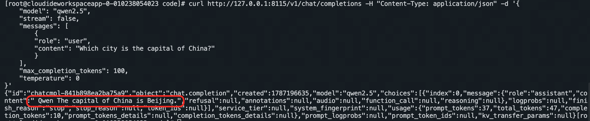
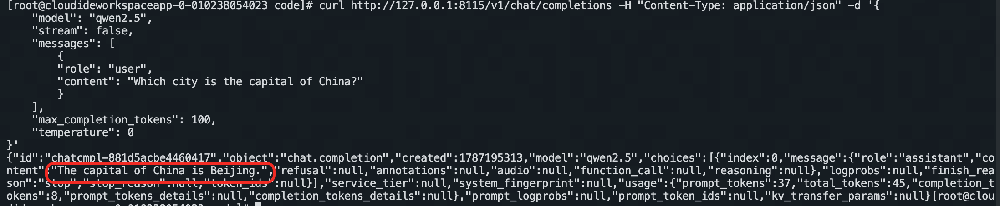
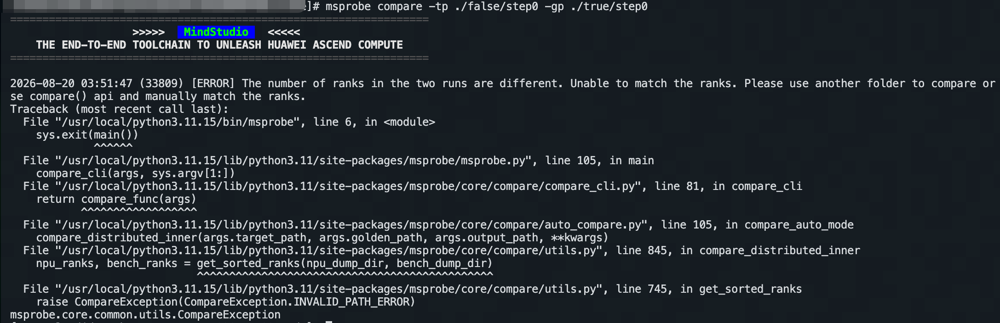
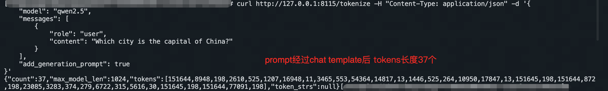
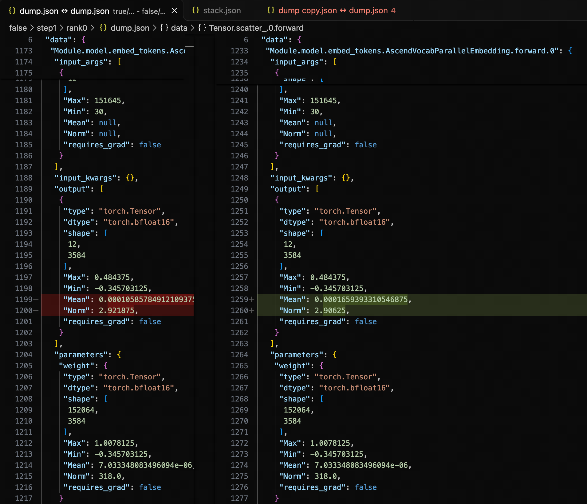
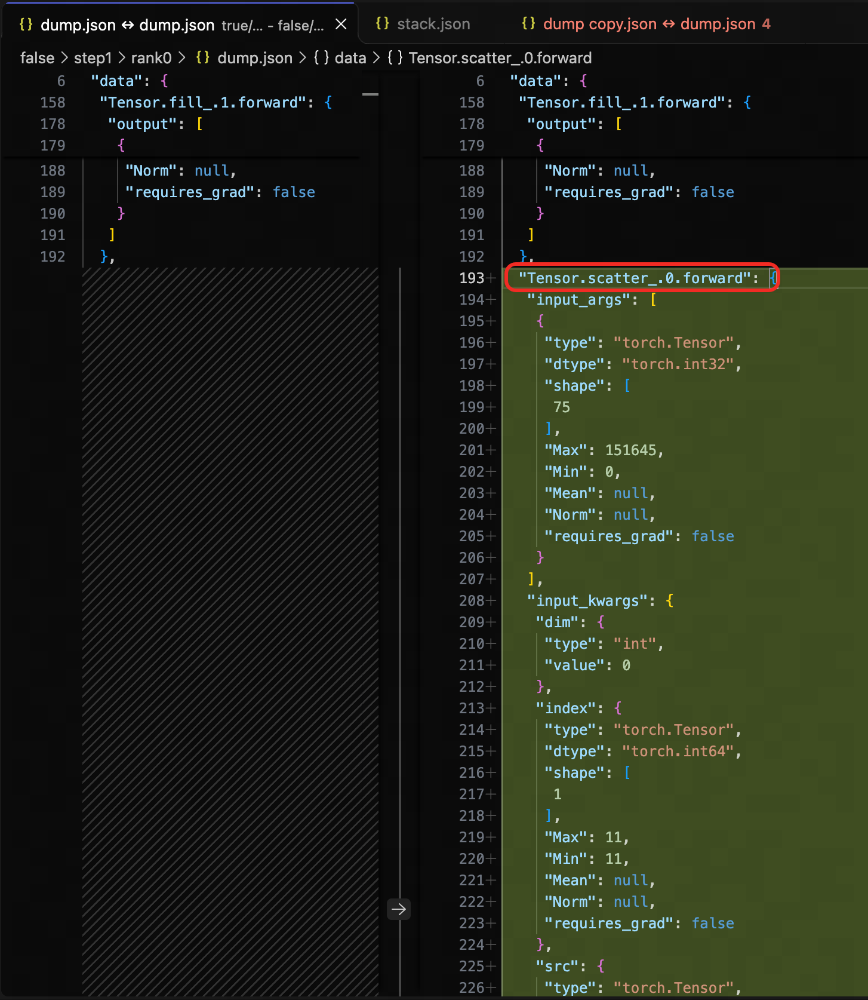
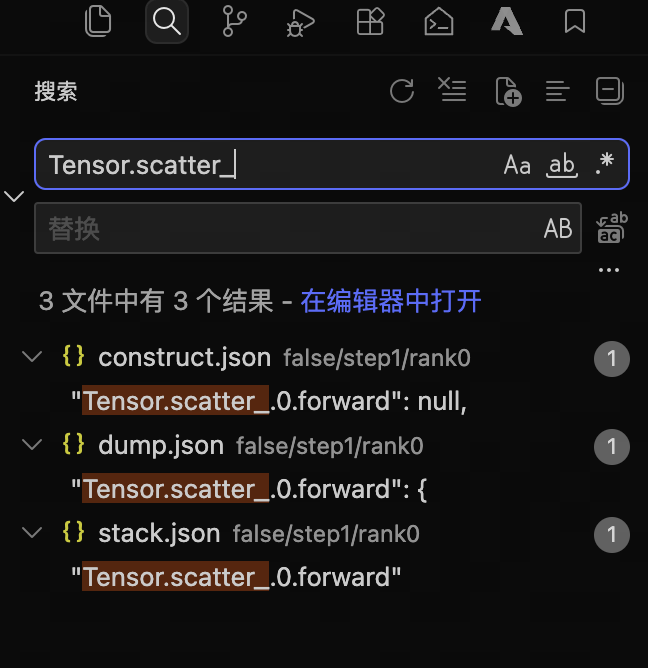
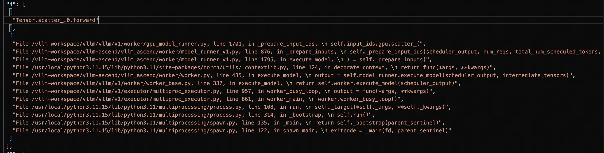
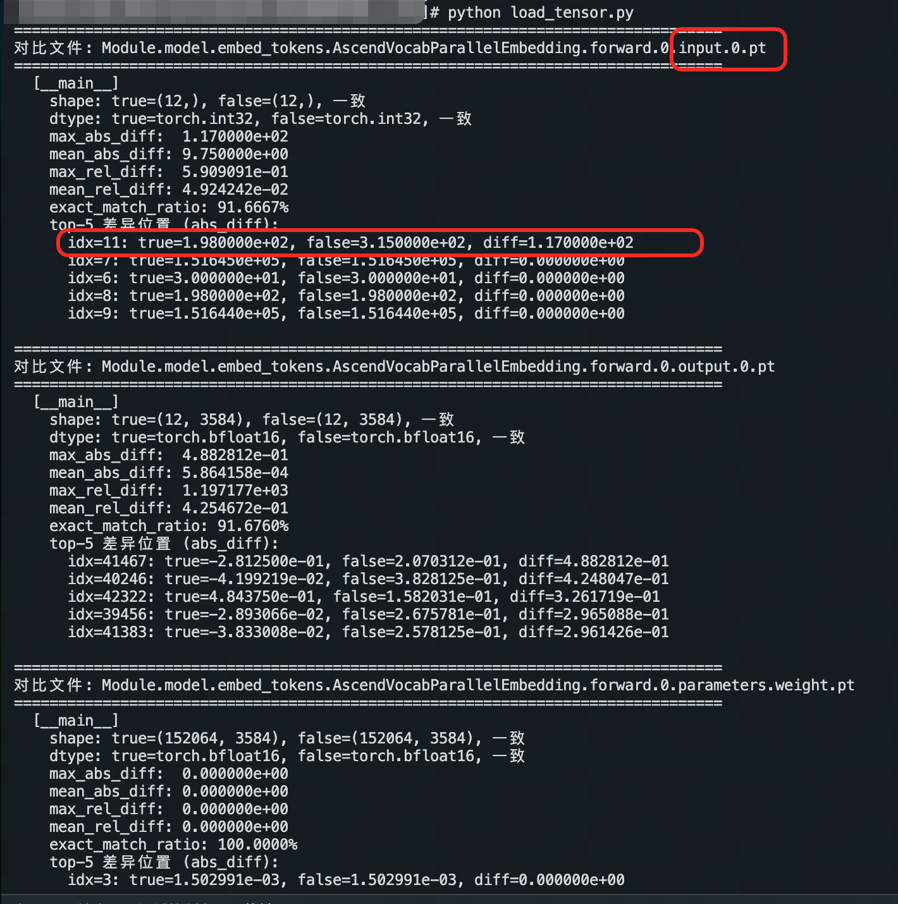
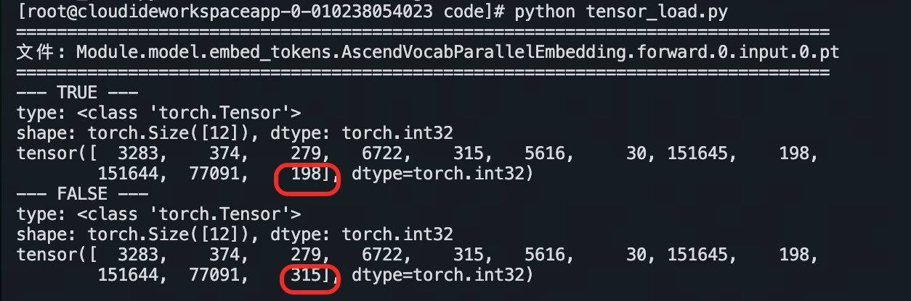

# 问题描述
问题场景服务启动命令：
``` bash
export ASCEND_RT_VISIBLE_DEVICES=0,1,2,3
export TASK_QUEUE_ENABLE=1
export HCCL_OP_EXPANSION_MODE="AIV"
nohup vllm serve /dpc_test/models/Qwen2.5-7B-Instruct/ \
  --served-model-name qwen2.5 \
  --trust-remote-code \
  --pipeline-parallel-size 2 \
  --tensor-parallel-size 2 \
  --max-model-len 1024 \
  --max-num-batched-tokens 25 \
  --port 8115 \
  --enforce-eager \
  --gpu-memory-utilization 0.9 \
  > ./vllm.log 2>&1 &
```
发送如下推理请求，发现首token错误：
``` bash
curl http://127.0.0.1:8115/v1/chat/completions -H "Content-Type: application/json" -d '{
    "model": "qwen2.5",
    "stream": false,
    "messages": [
        {
        "role": "user",
        "content": "Which city is the capital of China?"
        }
    ],
    "max_completion_tokens": 100,
    "temperature": 0
}'
```
 


关闭PP，发现推理正常，标杆场景服务启动命令：
```
export ASCEND_RT_VISIBLE_DEVICES=0,1,2,3
export TASK_QUEUE_ENABLE=1
export HCCL_OP_EXPANSION_MODE="AIV"
nohup vllm serve /dpc_test/models/Qwen2.5-7B-Instruct/ \
  --served-model-name qwen2.5 \
  --trust-remote-code \
  --pipeline-parallel-size 1 \
  --tensor-parallel-size 2 \
  --max-model-len 1024 \
  --max-num-batched-tokens 25 \
  --port 8115 \
  --enforce-eager \
  --gpu-memory-utilization 0.9 \
  > ./vllm.log 2>&1 &
```
发送如下推理请求，推理正常：
``` bash
curl http://127.0.0.1:8115/v1/chat/completions -H "Content-Type: application/json" -d '{
    "model": "qwen2.5",
    "stream": false,
    "messages": [
        {
        "role": "user",
        "content": "Which city is the capital of China?"
        }
    ],
    "max_completion_tokens": 100,
    "temperature": 0
}'
```



# 产品与版本
模型：Qwen2.5-7B-Instruct

vllm-ascend镜像版本：v0.20.2rc


# 定位过程
1、dump精度数据
pip install mindstudio-probe

启动服务时添加dump_config采集精度数据
``` bash
    --additional-config '{
        "dump_config": {
        "task": "statistics",
        "level": "mix",
        "dump_path": "./false",
        "statistics": {
            "list": []
        }
        }
    }'
```


2、数据比对（用工具或者人工比对）
因为首token异常，对比step0，但由于切分方式不同，msprobe工具无法对比切分方式不同的场景；
``` bash
msprobe compare -tp ./false/step0 -gp ./true/step0
```



为了便于比对，tp都改为1，问题场景切分策略改为pp2tp1，标杆场景切分策略改为pp1tp1；

因为是PP切分，只要保持tp切分一致，用msprobe工具的话可以先对比PP前半部分，再比对PP后半部分即可；
```bash
# 比对前14层
msprobe compare -tp ./false/step0/rank0/dump.json -gp ./true/step0/rank0/dump.json -o ./output0
# 比对后14层
msprobe compare -tp ./false/step0/rank1/dump.json -gp ./true/step0/rank0/dump.json -o ./output1
```

当然，直接人工比对也比较方便，
比对前14层：./false/step0/rank0/dump.json和./true/step0/rank0/dump.json
比对后14层：./false/step0/rank1/dump.json和./true/step0/rank0/dump.json


3、step0比对分析

比对step0发现完全一样，这就很奇怪了，首token明明不一样，但是step0的输出完全一样，这只能说明一个问题，进行chunk prefill了，但是服务参数max-num-batched-tokens 25，输入的"content": "Which city is the capital of China?"也没这么长，验证一下，通过v1/chat/completions/render或者/tokenize接口查看经过 `chat_template` 格式化后的完整token id
``` bash
curl http://127.0.0.1:8115/tokenize -H "Content-Type: application/json" -d '{
    "model": "qwen2.5",
    "messages": [
        {
            "role": "user",
            "content": "Which city is the capital of China?"
        }
    ],
    "add_generation_prompt": true
}'
```
经过 `chat_template` 格式化后的完整token id有37个，验证了chunk prefill猜想合理，那就得比对step1继续寻找线索



4、step1比对分析

从Embedding开始输出就不同，

并且开启pp后step1多了一个Tensor.scatter_.0.forward阶段，

且只有step1存在该操作，其他step都无Tensor.scatter_操作，聚焦该算子定位；

查看调用栈分析逻辑



5、dump tensor分析
因为dump tensor都是GB级别的，dump L0级别的前两个step就行了
``` bash
export ASCEND_RT_VISIBLE_DEVICES=0,1
export TASK_QUEUE_ENABLE=1
export HCCL_OP_EXPANSION_MODE="AIV"
nohup vllm serve /model/ \
    --served-model-name qwen2.5 \
    --trust-remote-code \
    --pipeline-parallel-size 2 \
    --tensor-parallel-size 1 \
    --max-model-len 1024 \
    --max-num-batched-tokens 25 \
    --port 8115 \
    --enforce-eager \
    --gpu-memory-utilization 0.9 \
    --additional-config '{
        "dump_config": {
        "task": "tensor",
        "step": [0,1],
        "level": "L0",
        "dump_path": "./false",
        "tensor": {
            "list": []
        }
        }
    }' > ./false.log 2>&1 &
```

``` bash
export ASCEND_RT_VISIBLE_DEVICES=4
export TASK_QUEUE_ENABLE=1
export HCCL_OP_EXPANSION_MODE="AIV"
nohup vllm serve /model/ \
    --served-model-name qwen25 \
    --trust-remote-code \
    --pipeline-parallel-size 1 \
    --tensor-parallel-size 1 \
    --max-model-len 1024 \
    --max-num-batched-tokens 25 \
    --port 8119 \
    --enforce-eager \
    --gpu-memory-utilization 0.9 \
    --additional-config '{
        "dump_config": {
        "task": "tensor",
        "step": [0,1],
        "level": "L0",
        "dump_path": "./true",
        "tensor": {
            "list": []
        }
        }
    }' > ./true.log 2>&1 &
```


咱只需要看看step1时候Module.model.embed_tokens.AscendVocabParallelEmbedding.forward.0的输入输出差异，没必要用msprobe去比较全部tensor了，让ai写个脚本比对
python tensor_diff.py


python tensor_load.py

PP=2 在 step1 把 step0 解码的 315 合并进同一 batch：vLLM V1 的 `_prepare_input_ids` 通过 `Tensor.scatter_(dim=0, index=11, src=315)` 把 315 写入 token buffer 的第 12 个位置。于是 FALSE step1 实际 input_ids 变成 `[tok_25, tok_26, …, tok_35, 315]`。


# 问题根因
1. **step0** 完成 chunk1 prefill 后，两端通过 argmax 都采样到第一个解码 token **315**，整个 forward 的统计量完全一致，跨卡 stage0→stage1 也没引入精度损失。
2. **PP=1 走纯 chunked prefill**：step1 只处理 chunk2 prompt 的 12 个 token，input_ids = `[tok_25, tok_26, …, tok_36]`。
3. **PP=2 在 step1 把 step0 解码的 315 合并进同一 batch**：vLLM V1 的 `_prepare_input_ids` 通过 `Tensor.scatter_(dim=0, index=11, src=315)` 把 315 写入 token buffer 的第 12 个位置。于是 FALSE step1 实际 input_ids 变成 `[tok_25, tok_26, …, tok_35, 315]`。


# 解决方法

规避方法1:关闭异步调度，--no-async-scheduling

规避方法2:增大max-num-batched-tokens规避chunk prefill

解决方法：如何正确的改代码有兴趣的自行分析。。。
vim /vllm-workspace/vllm/vllm/v1/worker/gpu_model_runner.py

# 经验总结
PP <-> 异步调度
PP的精度问题，第一时间检查是否开启异步调度，可尝试关闭异步调度后问题是否还存在，再继续定位根因
